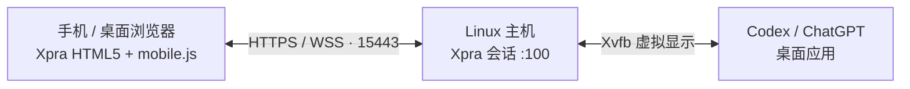

<p align="center">
  
</p>

<h1 align="center">Codex Console</h1>

<p align="center"><strong>把 Codex 工作台，带到手机浏览器。</strong></p>

<p align="center">
  在 Linux 主机上运行桌面应用，通过浏览器查看任务、输入指令、操作界面。<br />
  为触控、中文输入和小屏阅读优化的远程工作入口。
</p>

<p align="center">
  
  
  
</p>

<p align="center">
  <a href="#快速开始">快速开始</a> ·
  <a href="#手机操作">手机操作</a> ·
  <a href="#部署与维护">部署与维护</a> ·
  <a href="https://github.com/shenmuegit/codex-console/issues">问题反馈</a>
</p>

---

## 为移动操作而做

Codex Console 基于 Xpra，把主机上的 Codex / ChatGPT 桌面应用窗口传送到浏览器。计算、项目文件和应用进程留在主机上；手机负责显示与交互。

| 能力 | 使用体验 |
| --- | --- |
| 屏幕适配 | 根据浏览器可视区域缩放窗口，适应横竖屏与软键盘弹出后的空间 |
| 触控操作 | 轻触点击、滑动拖拽、双击右键、二次按住滑动滚动 |
| 手机输入法 | 使用手机的拼音、双拼等输入法组合文字，确认后提交到远程应用 |
| 三档画质 | 在流畅、均衡、高清之间即时切换，选择会保留在当前页面地址中 |
| 声音转发 | 将远程应用的声音传送到浏览器，麦克风转发默认关闭 |
| 独立应用配置 | 使用专属配置目录保存登录状态与应用数据 |

## 工作方式



`console.sh` 负责启动会话、准备访问密码与证书，并生成浏览器入口；`mobile.js` 负责触控、画面缩放、画质设置与手机输入法桥接。

## 快速开始

### 1. 准备主机环境

在 Linux 主机上准备以下组件，使用普通桌面用户运行控制台。

| 组件 | 要求 |
| --- | --- |
| Xpra 与 HTML5 客户端 | 当前脚本面向 Xpra 6.5.x；HTML5 资源位于 `/usr/share/xpra/www` |
| 虚拟显示与声音 | Xvfb、PulseAudio，以及 Xpra 对应的音频编码依赖 |
| 脚本运行环境 | Bash、Python 3、OpenSSL、GNU coreutils |
| 桌面应用 | 已安装可在 Linux / X11 下运行的 Codex / ChatGPT 桌面应用；默认启动路径为 `/usr/bin/chatgpt` |

Xpra 的安装方式见 [官方安装文档](https://github.com/Xpra-org/xpra/wiki/Download)，浏览器客户端见 [Xpra HTML5](https://github.com/Xpra-org/xpra-html5)。本机核对的版本为 Xpra `6.5.4` 与 `xpra-html5 19-r1`；其他版本升级后需验证客户端接口与页面结构。

桌面应用需自行安装。先确认关键组件就绪：

```bash
xpra --version
test -f /usr/share/xpra/www/index.html
test -x /usr/bin/chatgpt
```

### 2. 获取项目并确认应用配置

```bash
git clone https://github.com/shenmuegit/codex-console.git
cd codex-console
```

在 [console.sh](console.sh) 的 `--start-child` 参数中确认以下设置：

| 设置 | 默认值 | 调整方式 |
| --- | --- | --- |
| 应用路径 | `/usr/bin/chatgpt` | 改为本机桌面应用的可执行路径 |
| 应用网络代理 | `http://127.0.0.1:7890` | 改为本机代理地址；不使用代理时移除 `--proxy-server` 参数 |
| 显示后端 | `--ozone-platform=x11` | 应用运行在 Xpra 提供的 X11 会话中 |

这些值直接写在启动脚本中。代理参数用于主机上的桌面应用，手机连接使用主机的 HTTPS 地址。

### 3. 启动控制台

```bash
./console.sh start
./console.sh status
```

首次启动会自动生成随机访问密码、自签名 TLS 证书和独立应用配置目录。省略参数运行 `./console.sh` 也会启动会话。

在主机终端读取访问密码：

```bash
cat "${XDG_STATE_HOME:-$HOME/.local/state}/codex-console/password"
```

### 4. 从浏览器连接

手机连接到能够访问主机的网络，打开 `https://主机IP:15443/`，在认证提示中输入访问密码。

默认证书为自签名证书，且只包含 `localhost` 与 `127.0.0.1`，通过主机 IP 访问时浏览器会提示证书不受信任或名称不匹配。确认连接目标后处理证书提示；长期使用时换成与访问地址匹配的受信任证书。

首次进入后，在远程桌面应用中登录账号。控制台使用独立配置目录，已有桌面应用的登录状态未必会自动带入。

## 手机操作

### 手势

| 操作 | 手势 |
| --- | --- |
| 左键点击 | 轻触一次 |
| 拖拽 / 选择 | 按下后直接滑动 |
| 右键菜单 | 在同一位置快速轻触两次 |
| 滚动 | 轻触一次，再次按住并滑动 |
| 唤起输入法 | 先选中远程文本框，再点击左上角工具栏的键盘按钮 |

双击手势的判定窗口为约 180 ms。滚动时，第二次触碰要保持按住；普通的按下滑动会执行拖拽。

### 中文输入

输入法候选与组合过程留在手机端，确认后的文字通过 Xpra 剪贴板与粘贴快捷键提交到远程应用。拼音、双拼等输入方式沿用手机已有设置。

连接需启用 Xpra 剪贴板。提交文字会更新远程剪贴板；连接不可用时，尚未提交的文字会保留在输入框中。

### 画质与声音

从左上角工具栏打开「画质与流畅度」，切换后立即生效。

| 档位 | 地址参数 | 适用场景 |
| --- | --- | --- |
| 流畅 | `?performance=smooth` | 优先交互响应，减少画面传输负担 |
| 均衡（默认） | `?performance=balanced` | 日常操作与阅读 |
| 高清 | `?performance=sharp` | 优先文字与界面细节，增加渲染密度 |

也可以直接在访问地址后添加对应参数。画质选择会更新当前页面地址，刷新后沿用该地址中的设置。

声音由主机转发到浏览器，可在 Xpra 工具栏中开启播放；浏览器可能需要一次点击才能允许播放。当前启动配置关闭了麦克风转发。

## 部署与维护

### 会话管理

```bash
./console.sh status   # 查看窗口与会话状态
./console.sh stop     # 停止会话及其桌面应用
./console.sh start    # 再次启动
```

修改启动参数后，先停止再启动会话。应用配置与登录数据保留在状态目录中。

### 数据位置

默认状态目录为 `~/.local/state/codex-console`；设置 `XDG_STATE_HOME` 后，目录变为 `$XDG_STATE_HOME/codex-console`。

| 路径 | 内容 |
| --- | --- |
| `password` | 浏览器访问密码 |
| `cert.pem` / `key.pem` | TLS 证书与私钥 |
| `profile/` | 独立的桌面应用配置与登录数据 |
| `www/` | 生成的 HTML5 入口与静态资源链接 |
| `xpra.log` | 会话运行日志 |

状态目录权限为 `700`，密码、证书和私钥文件权限为 `600`。密码与证书在后续启动时复用；备份 `profile/` 可保留应用配置。

### 网络与访问范围

当前配置监听 `0.0.0.0:15443`，使用固定显示号 `:100`，适合单用户的独立应用会话。限制访问范围时，修改 `console.sh` 中的 `--bind-wss` 地址，或通过防火墙 / VPN 控制可访问的设备。

Xpra 的新命令、远程 shell、文件传输、打印、摄像头以及远程打开文件和 URL 的附加服务已关闭。通过认证的用户仍可操作桌面应用及其权限内的资源，因此访问密码应只提供给可信用户。

## 常见问题

| 现象 | 排查方式 |
| --- | --- |
| 浏览器无法打开入口 | 确认会话已启动、访问地址正确，并检查主机防火墙与 `15443` 端口 |
| 能打开页面但认证失败 | 使用状态目录中的 `password`；它与桌面应用账号密码分别用于不同的登录步骤 |
| 启动后没有应用窗口 | 检查应用路径与代理参数，并查看 `xpra.log` |
| 中文无法提交 | 确认连接已就绪、Xpra 剪贴板已启用，且远程文本框已获得焦点 |
| 界面卡顿或流量较高 | 切换到「流畅」档位，并检查主机与手机之间的网络 |
| 没有声音 | 在工具栏开启声音，并检查浏览器播放权限与主机的 PulseAudio / 音频编码依赖 |

## 开发与验证

项目直接复用系统安装的 Xpra HTML5 客户端。移动交互检查额外需要 Node.js 20 或更新版本，以及当前 Python 环境可导入的 Xpra 模块。

```bash
bash -n console.sh
node test_mobile.cjs
```

`test_mobile.cjs` 验证触控事件、坐标缩放、画质设置与手机输入法的文字提交，无需打开浏览器。

启动控制台后，可运行实际端点检查：

```bash
python3 test_console.py
```

该检查验证 HTTPS、正确与错误密码认证、应用窗口，以及通过 WSS 接收并解码的音频。需要 X11 检查工具 `xrdb`、`xdpyinfo`，以及 `gst-launch-1.0` 和对应的 GStreamer 音频插件。

反馈问题时，请附上主机系统、Xpra / HTML5 客户端版本、浏览器版本及相关日志，并移除密码、账号信息和私有内容：[提交 Issue](https://github.com/shenmuegit/codex-console/issues)。
