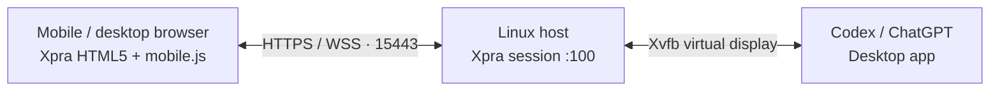

<p align="center">
  
</p>

<h1 align="center">Codex Console</h1>

<p align="center"><strong>Your Codex workspace, in your mobile browser.</strong></p>

<p align="center">
  Run the desktop app on a Linux host. Check tasks, enter instructions, and control the interface from your browser.<br />
  Built for touch interaction, native mobile input, and small-screen reading.
</p>

<p align="center">
  
  
  
</p>

<p align="center">
  <a href="#quick-start">Quick start</a> ·
  <a href="#mobile-controls">Mobile controls</a> ·
  <a href="#deployment-and-maintenance">Deployment</a> ·
  <a href="https://github.com/shenmuegit/codex-console/issues">Report an issue</a>
</p>

---

## Built for mobile control

Codex Console uses Xpra to stream the Codex / ChatGPT desktop app window from your host to a browser. Computation, project files, and application processes stay on the host; your phone handles display and interaction.

| Capability | Experience |
| --- | --- |
| Adaptive layout | Fits the browser's visible area, including orientation changes and space above the on-screen keyboard |
| Touch controls | Tap to click, slide to drag, double-tap for a right-click, and tap-then-hold to scroll |
| Native mobile input | Compose text with your phone's input method, then send committed text to the remote app |
| Three quality profiles | Switch instantly between Smooth, Balanced, and Sharp; the selected profile stays in the page URL |
| Audio forwarding | Play remote application audio in the browser; microphone forwarding is disabled by default |
| Dedicated app profile | Store application settings and sign-in data in a separate profile directory |

## How it works



`console.sh` starts the session, prepares the access password and TLS certificate, and generates the browser entry page. `mobile.js` handles touch gestures, viewport scaling, quality settings, and mobile input-method integration.

## Quick start

### 1. Prepare your host

Install the following components on a Linux host. Run the console as a regular desktop user.

| Component | Requirement |
| --- | --- |
| Xpra and HTML5 client | The current script targets Xpra 6.5.x, with HTML5 assets at `/usr/share/xpra/www` |
| Virtual display and audio | Xvfb, PulseAudio, and the audio codec dependencies required by Xpra |
| Script runtime | Bash, Python 3, OpenSSL, and GNU coreutils |
| Desktop app | A Codex / ChatGPT desktop app that runs on Linux / X11; the default executable is `/usr/bin/chatgpt` |

Follow the [official Xpra installation guide](https://github.com/Xpra-org/xpra/wiki/Download) and see [Xpra HTML5](https://github.com/Xpra-org/xpra-html5) for the browser client. The local environment was checked with Xpra `6.5.4` and `xpra-html5 19-r1`. Verify client interfaces and page structure when upgrading to another version.

Install the desktop app separately, then check the key components:

```bash
xpra --version
test -f /usr/share/xpra/www/index.html
test -x /usr/bin/chatgpt
```

### 2. Get the project and configure the app

```bash
git clone https://github.com/shenmuegit/codex-console.git
cd codex-console
```

Review these settings in the `--start-child` argument in [console.sh](console.sh):

| Setting | Default | Configuration |
| --- | --- | --- |
| App executable | `/usr/bin/chatgpt` | Replace with your desktop app's executable path |
| App network proxy | `http://127.0.0.1:7890` | Set your local proxy address, or remove `--proxy-server` if you do not use a proxy |
| Display backend | `--ozone-platform=x11` | Runs the app in the X11 session provided by Xpra |

These values are defined directly in the launch script. The proxy setting applies to the desktop app on the host; your phone connects to the host's HTTPS address.

### 3. Start the console

```bash
./console.sh start
./console.sh status
```

The first launch generates a random access password, a self-signed TLS certificate, and a dedicated application profile. Running `./console.sh` without an argument also starts the session.

Read the access password in your host terminal:

```bash
cat "${XDG_STATE_HOME:-$HOME/.local/state}/codex-console/password"
```

### 4. Connect from your browser

Connect your phone to a network that can reach the host. Open `https://HOST_IP:15443/`, replacing `HOST_IP` with your host's IP address, and enter the access password when prompted.

The generated certificate is self-signed and covers only `localhost` and `127.0.0.1`. Access through the host's IP address will trigger an untrusted-certificate or hostname-mismatch warning. Confirm the connection target before handling the warning. For ongoing use, replace the certificate with a trusted certificate matching your access address.

On your first connection, sign in within the remote desktop app. The console uses a separate application profile, so an existing desktop sign-in may not carry over.

## Mobile controls

### Gestures

| Action | Gesture |
| --- | --- |
| Left-click | Tap once |
| Drag / select | Touch and slide |
| Right-click menu | Quickly tap twice in the same place |
| Scroll | Tap once, then touch again and slide while holding |
| Open the keyboard | Focus a remote text field, then tap the keyboard button in the top-left toolbar |

The double-tap recognition window is approximately 180 ms. To scroll, keep the second touch held while sliding. A single touch-and-slide performs a drag.

### Text input and IME

Text composition and candidate selection stay on your phone. Once confirmed, text is sent to the remote app through the Xpra clipboard and a paste shortcut. Chinese input methods such as Pinyin and Double Pinyin use your phone's existing settings.

Enable the Xpra clipboard for the connection. Committing text updates the remote clipboard. If the connection is unavailable, text that has not been submitted is retained in the input field.

### Quality and audio

Open the quality control in the top-left toolbar. Profile changes take effect immediately.

| Profile | URL parameter | Use case |
| --- | --- | --- |
| Smooth | `?performance=smooth` | Prioritize interaction speed and reduce display-streaming load |
| Balanced (default) | `?performance=balanced` | Everyday interaction and reading |
| Sharp | `?performance=sharp` | Prioritize text and interface detail with higher rendering density |

You can also add the parameter directly to the connection URL. Changing the profile updates the current page URL, so refreshing that address retains the selection.

The host forwards application audio to the browser. Enable playback in the Xpra toolbar; your browser may require a click before allowing audio. The current launch configuration disables microphone forwarding.

## Deployment and maintenance

### Session management

```bash
./console.sh status   # Inspect the session and its windows
./console.sh stop     # Stop the session and its desktop app
./console.sh start    # Start again
```

After changing launch settings, stop and restart the session. Application settings and sign-in data remain in the state directory.

### Data storage

The default state directory is `~/.local/state/codex-console`. If `XDG_STATE_HOME` is set, the directory becomes `$XDG_STATE_HOME/codex-console`.

| Path | Contents |
| --- | --- |
| `password` | Browser access password |
| `cert.pem` / `key.pem` | TLS certificate and private key |
| `profile/` | Dedicated application settings and sign-in data |
| `www/` | Generated HTML5 entry page and static asset links |
| `xpra.log` | Session log |

The state directory has permissions `700`; the password, certificate, and private key files have permissions `600`. Subsequent launches reuse the password and certificate. Back up `profile/` to preserve application settings.

### Network and access

The current configuration listens on `0.0.0.0:15443` and uses the fixed display number `:100`. It is intended for a single user's dedicated application session. Restrict access by changing the `--bind-wss` address in `console.sh`, or by controlling reachable devices through a firewall or VPN.

Xpra's additional services for new commands, remote shell, file transfer, printing, webcam access, and opening files or URLs are disabled. Authenticated users can still control the desktop app and access resources available to it, so share the access password only with trusted users.

## Troubleshooting

| Symptom | What to check |
| --- | --- |
| Browser cannot open the console | Confirm the session is running, the address is correct, and the host firewall allows access to port `15443` |
| Page loads, but authentication fails | Use the state directory's `password`; browser access and desktop account sign-in are separate authentication steps |
| No application window after launch | Check the app executable and proxy settings, then inspect `xpra.log` |
| Composed text is not submitted | Confirm the connection is ready, the Xpra clipboard is enabled, and the remote text field has focus |
| Display is slow or uses too much bandwidth | Switch to Smooth and check the network between your phone and the host |
| No audio | Enable audio in the toolbar and check browser playback permissions, PulseAudio, and the host's audio codec dependencies |

## Development and verification

The project reuses the system-installed Xpra HTML5 client. Mobile interaction checks additionally require Node.js 20 or newer and Xpra modules importable from the current Python environment.

```bash
bash -n console.sh
node test_mobile.cjs
```

`test_mobile.cjs` checks touch events, coordinate scaling, quality settings, and mobile input-method text submission without opening a browser.

After starting the console, run the live endpoint check:

```bash
python3 test_console.py
```

This check verifies HTTPS, accepted and rejected password authentication, the application window, and audio received and decoded over WSS. It requires the X11 tools `xrdb` and `xdpyinfo`, plus `gst-launch-1.0` and the relevant GStreamer audio plugins.

When reporting a problem, include your host OS, Xpra / HTML5 client versions, browser version, and relevant logs. Remove passwords, account details, and private content before [opening an issue](https://github.com/shenmuegit/codex-console/issues).
