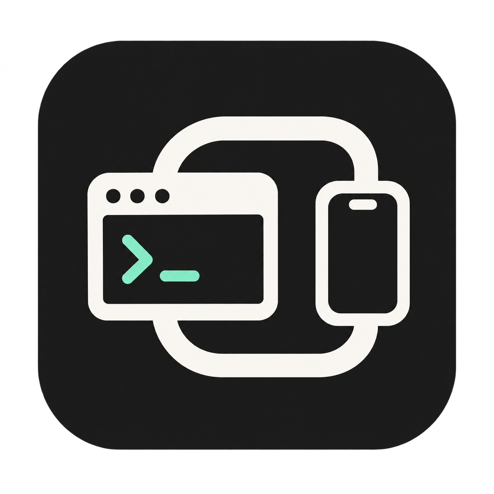

<p align="center">
  
</p>

<h1 align="center">Codex Console</h1>
<p align="center"><strong>在手机浏览器中使用你的 Codex 工作区。</strong></p>
<p align="center">
  <a href="README.md">English</a> ·
  <a href="#快速开始">快速开始</a> ·
  <a href="#文档导航">文档</a> ·
  <a href="https://github.com/shenmuegit/codex-console/issues">反馈问题</a>
</p>

**原生浏览器客户端：**新增的 `web/` 客户端连接共享原生 Codex app-server，以认证 HTTPS 提供项目、会话、文件/照片、模型/用量和 `@`/`$`/`/` 输入。安装和使用见[原生客户端操作说明](docs/zh-CN/native-web-client.md)。

下文记录的桌面窗口访问通过 [Xpra](https://github.com/Xpra-org/xpra)，把 Linux 主机上的 Codex / ChatGPT 应用窗口传输到浏览器。你可以用手机查看任务、使用本机输入法输入指令、操作远端界面。项目文件、计算、账号会话和应用进程都保留在主机上。

本项目提供远程访问层。**需要提前安装兼容的 Linux 桌面应用**；部署脚本不负责下载该应用或登录账号。当前浏览器界面使用简体中文。

## 功能

| 功能 | 使用体验 |
| --- | --- |
| 手机布局 | 适配可见区域、横竖屏切换与屏幕键盘 |
| 触摸操作 | 即时单击、拖动、双指右键与双指滚动 |
| 原生输入法 | 在手机上完成输入与选词，再将确认的文本粘贴到远端 |
| 文件上传 | 先点击 Codex 原生上传按钮，再选择手机或电脑上的文件 |
| 三档画质 | 流畅、均衡、高清；选择保存在页面地址中 |
| 音频播放 | 浏览器播放主机应用音频，默认关闭麦克风转发 |
| 独立应用数据 | 独立保存设置与登录信息，过滤无关窗口 |
| 应用恢复 | 主窗口关闭后自动打开，应用退出后自动启动 |
| 一键部署 | 检查依赖、准备凭据、生成并启动用户服务 |

## 环境要求

| 项目 | 要求 |
| --- | --- |
| 主机 | Linux；自动安装依赖支持 Debian 12/13、Ubuntu 22.04/24.04 |
| 用户 | 使用普通用户运行；安装缺失的系统包需要 sudo；自动启动需要 systemd 用户会话 |
| 桌面应用 | 兼容 Linux / X11 的 Codex / ChatGPT 构建，默认路径 `/usr/bin/chatgpt` |
| 运行依赖 | Bash、Python 3.10+、OpenSSL、Xpra 6.5+（限 6.x）、Xvfb、PulseAudio |
| 浏览器客户端 | 已验证基线为 `xpra-html5 19-r1`，默认位于 `/usr/share/xpra/www` |
| 浏览器 | 支持 JavaScript 和 WebSocket 的现代手机或桌面浏览器 |
| 网络 | 浏览器能够访问主机，默认 TCP 端口为 `15443` |

开发主机已验证 Debian 13、Xpra `6.5.4`、`xpra-html5 19-r1`。表中其他系统有安装脚本支持，并非均已在本地进行真实会话验证。Windows、macOS 可作为浏览器客户端；当前脚本面向 Linux 主机。

当前应用集成要求窗口类名为 `Chatgpt`，实例名为 `chatgpt (<profile 路径>)`。修改可执行文件路径适用于同一兼容应用的不同安装位置；使用其他构建前请查看[兼容性说明](docs/zh-CN/deployment.md#桌面应用兼容性)。

## 快速开始

提前安装桌面应用和 Git，然后使用普通用户执行：

```bash
git clone https://github.com/shenmuegit/codex-console.git
cd codex-console
./deploy.sh
```

如果应用没有安装在默认位置：

```bash
./deploy.sh --app /absolute/path/to/chatgpt
```

脚本会复用已有的兼容依赖，必要时通过 Xpra 官方 APT 软件源安装系统包，然后创建私有配置、生成随机访问密码、按实际克隆位置生成用户服务、启用服务并等待 HTTP 页面就绪。详见[部署脚本修改的内容](docs/zh-CN/deployment.md#脚本修改哪些内容)。

在主机终端查看访问密码：

```bash
./console.sh password
```

手机打开 `http://HOST_IP:15443/`，将 `HOST_IP` 替换为 Linux 主机地址。输入访问密码后，首次使用需要在远端桌面应用中登录账号。浏览器访问密码与应用账号登录是两个独立步骤；独立应用数据目录可能需要重新登录。

控制台默认使用 HTTP/WS，传输内容不加密。配置浏览器信任的证书和私钥可启用[原生 HTTPS/WSS](docs/zh-CN/configuration.md#http-与-https-访问)。建议通过可信网络或 VPN 访问；持有访问密码的人可以使用主机账号的权限操作应用。

## 日常操作

```bash
./console.sh doctor                                # 检查配置与依赖
./console.sh status                                # 查看 Xpra 会话
systemctl --user status codex-console.service      # 查看用户服务
systemctl --user restart codex-console.service     # 应用配置修改
systemctl --user stop codex-console.service        # 停止托管会话
journalctl --user -u codex-console.service -n 100   # 查看服务日志
```

手动运行可先执行 `./deploy.sh --no-service --no-start`，再使用 `./console.sh start` 和 `./console.sh stop`。重复部署保留已有配置、密码与应用数据；普通重复部署会重启托管服务，`--no-start` 只准备改动，不启动或重启。

网页只发布定制的 Codex Console 主页面。`connect.html` 等上游连接、诊断页面及其压缩版本均返回 404；准备资源时也会清理旧部署遗留的这些页面。

## 手机操作

| 操作 | 手势 |
| --- | --- |
| 左键单击 | 轻点一次 |
| 拖动或选择 | 按住后滑动 |
| 右键菜单 | 双指同时轻点 |
| 滚动 | 双指同时滑动 |
| 打开键盘 | 先聚焦远端输入框，再打开右上角抽屉中的键盘按钮 |
| 全屏与音频 | 打开右侧抽屉并点击相应按钮 |

单击在手指抬起时立即发送，连续轻点仍为左键点击。一次按住滑动执行拖动。输入和选词在手机本机完成，确认文本通过远端剪贴板和粘贴快捷键发送；请保持远端输入框聚焦和 Xpra 剪贴板启用。提交文本会替换远端剪贴板内容。确认文字后立即开始粘贴，连续粘贴保留 100 毫秒的剪贴板保护间隔。HTTPS 访问时，输入确认和上传使用本次准备的剪贴板内容，避免设备旧内容覆盖。

通过画质菜单切换流畅、均衡或高清，也可使用地址参数 `?performance=smooth`、`?performance=balanced`、`?performance=sharp`。默认使用均衡。浏览器可能需要一次点击后才允许播放音频。

上传时先点击远端 Codex 聊天框的附件/上传按钮，网页会盖住 Linux 目录选择框并显示上传弹层。「选择图片」打开图片选择入口；「选择文件」打开当前设备的通用文件选择器，Chromium 不会为该入口额外添加拍照、录像选项。上传完成后由 Codex 添加附件，发送前确认聊天框中已出现附件。「取消添加」会关闭 Codex 的选择框；断线或切换选择框会停止自动添加。登录和重新连接会取消上一次遗留的选择框，只有之后新打开的上传操作才显示弹层。手机没有回传选择或取消事件时，可以再次点击文件入口重试。

首版每次一个文件，支持不同文件类型、中文和空格文件名；上限为 32 MiB 或服务器限制中的较小值。空文件、控制字符文件名和超过 185 个 UTF-8 字节的文件名会被拒绝。文件保存在私有状态目录的 `uploads/` 下，供 Codex 后续读取，不自动删除；不再需要时可自行清理。修改后需重启服务并刷新页面。

## 文档导航

| 文档 | 内容 |
| --- | --- |
| [部署与维护](docs/zh-CN/deployment.md) | 系统支持、脚本参数、手动运行、开机启动、更新、备份恢复、卸载 |
| [配置参考](docs/zh-CN/configuration.md) | 配置文件、全部配置项、目录、HTTP/HTTPS、密码、网络监听 |
| [故障排查](docs/zh-CN/troubleshooting.md) | 安装、服务、认证、窗口、输入法、音频、性能问题 |
| [开发说明（English）](docs/development.md) | 代码结构、隔离测试、真实链路验证、依赖升级、发布步骤 |
| [贡献指南](CONTRIBUTING.md) | 本地开发、问题反馈、提交规范 |
| [安全说明](SECURITY.md) | 访问边界、敏感数据、漏洞反馈 |
| [变更记录](CHANGELOG.md) | 待发布改动 |

配置默认保存在 `~/.config/codex-console/config.sh`，应用数据默认保存在 `~/.local/state/codex-console`，分别遵循对应的 XDG 环境变量。个人配置、访问密码、私钥和登录数据保存在仓库之外。

## 开发验证

本仓库不配置 GitHub Actions 自动检查，推送和 PR 不会触发仓库工作流；发布前请手动执行适用的本地验证。

安装运行依赖及 Node.js 20+ 后：

```bash
./scripts/check.sh           # 隔离验证，不启动你的桌面应用
./scripts/check.sh --live    # 同时检查已启动的会话，并播放测试音
```

真实链路检查需要正在运行的会话和 GStreamer 音频插件。对使用中的会话执行前，请阅读[开发说明](docs/development.md)。

## 许可证与致谢

本项目代码和随附图标使用 [MIT 许可证](LICENSE)。Xpra、Xpra HTML5 客户端以及桌面应用属于独立项目，遵循各自的许可证。运行时从系统安装目录链接 HTML5 资源，在私有数据目录中生成适配后的页面；仓库不内置这些上游资源。

本项目为独立项目，并非 OpenAI 官方产品。
