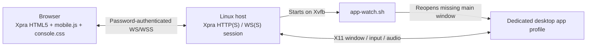

# Development and verification

[README](../README.md) · [Contributing](../CONTRIBUTING.md)

## Components



| File | Responsibility |
| --- | --- |
| `deploy.sh` | Dependency installation, user config, service generation, readiness check, uninstall |
| `lib/config.sh` | Configuration defaults, validation, read-only preflight |
| `console.sh` | Credentials, HTML5 adaptation, Xpra launch and session commands |
| `app-watch.sh` | Single supervisor lock, dedicated-window filter, app recovery and cleanup |
| `mobile.js` | Touch, native IME, scaling, quality, authentication/reconnect behavior |
| `upload.py` | Completed-upload validation, original filename and targeted browser callback |
| `console.css` | Login, connection, and toolbar layout |
| `codex-console.service` | User-service template rendered by deployment |
| `scripts/check.sh` | Standard isolated checks and optional live endpoint verification |

There is no Node build or package installation for the frontend. The browser runs `mobile.js` directly against the system Xpra HTML5 client. The adapted HTML/Client.js are generated in the private state directory. Only the adapted index page is published; upstream HTML pages and their compressed copies are excluded and cleaned up on upgrades. Host-installed upstream assets remain untouched. The launcher includes a content-derived cache version in the page.

## Local checks

Install the normal runtime and Node.js 20+; Python must be able to import the installed Xpra modules. Prefer the OS Python used by your Xpra packages instead of an isolated interpreter missing those modules.

```bash
./scripts/check.sh
```

| Check | Coverage |
| --- | --- |
| Bash syntax | All shell entry points and config example |
| `test_startup.py` | Foreground service launch vs daemonized manual launch |
| `test_deploy.py` | Config validation, argument quoting, alternate state/port/display, HTTP startup, configured TLS and certificate preservation, service rendering, repeat install, dependency installation boundary, relocation, uninstall |
| `test_app_watch.py` | Reopening closed/exited app, avoiding duplicates, excluding foreign profiles, cleaning up children |
| `test_mobile.cjs` | Browser authentication, retry/reconnect, gestures, scaling, quality, IME and UTF-8 clipboard behavior |
| `test_upload.py` | Real Xpra save completion, private original filenames, request and client isolation |

Isolated tests use temporary directories and controlled command boundaries. They do not install packages or modify your user service, and they do not start your desktop app. They still load the real installed Xpra client code and selected server modules. The watcher test takes roughly 20 seconds because it exercises the actual recovery intervals.

## Temporary integration session

Use the runtime's GTK 3 Python bindings, then run:

```bash
python3 test_integration.py
CONSOLE_TEST_TLS=1 python3 test_integration.py
```

This runs the real one-command deployment in manual mode with a temporary config, state directory, local port, and unused X11 display. A GTK fixture supplies the app identity and a native file picker without a profile class or transient parent. It verifies HTTP, correct and rejected passwords, window isolation, decoded WS audio, and upload completion followed by Unicode clipboard/key packets that make the original picker accept the file. It then stops the session. It uses no desktop-app account and does not change your service; compatibility with a particular app build still needs that app. The TLS variant generates a temporary identity, explicitly trusts it for the test, and checks HTTPS/WSS on the same paths.

## Existing-app live check

After starting a compatible app session:

```bash
./scripts/check.sh --live
```

This uses the selected configuration, attaches additional Xpra clients, and plays a brief 440 Hz test tone into the session's audio server. Use a session where that interaction is acceptable. The live check requires `xrdb`, `xdpyinfo`, `gst-launch-1.0`, and GStreamer Opus/WebM/AAC plugins in addition to the normal runtime. It verifies the actual app's forwarded windows, audio codecs, display bounds, private file permissions, and authentication behavior.

## Upgrading Xpra or the HTML5 client

The supported baseline is Xpra `6.5.4` and HTML5 `19-r1`. Required upstream page hooks are checked before preparation; this is not a guarantee of compatibility with every client release.

Before adopting another release:

1. Prepare a separate test config, state, display, and port; retain a package rollback path.
2. Run `doctor`, isolated checks, and the temporary integration session.
3. Check touch gestures, composition/candidate selection, paste, portrait/landscape behavior, and on-screen keyboard movement in a real mobile browser.
4. Check password entry, rejected passwords, disconnect/reconnect, drawer toggles, quality profiles, fullscreen, and audio.
5. Verify only the intended profile is forwarded and that closing/reopening the app still works.
6. Record the tested app/browser/package versions before changing the documented baseline or preflight rules.

## CI and release preparation

The GitHub Actions workflow prepares the runtime on Ubuntu 24.04, runs isolated checks, and exercises a temporary integration session. It does not use app credentials. CI configuration is included here; a local check does not certify a remote Actions run.

For a release, run the checks on the supported runtime, confirm both README languages and linked guides match the script behavior, review the diff for private data, move relevant `Unreleased` entries into a versioned changelog section, and create the corresponding tag/release. Published tags should identify the exact source commit.
