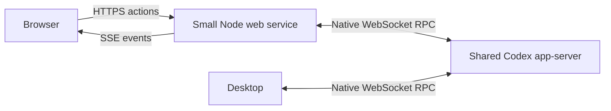

# Native browser client: design and delivery plan

[中文](../../zh-CN/superpowers/specs/2026-10-07-native-web-client-design.md)
· [Source investigation](../../codex-source.md)
· [Verified backend test](../../local-app-server-test.md)

Revised and approved by the user on 2026-10-08. Browser-client implementation has
not started. This revision replaces the IPC-first design with the verified shared
app-server route. The [implementation plan](../plans/2026-10-08-native-web-client.md)
is the next review artifact.

## Goal and scope

Open `https://HOST_IP:PORT` from a browser and manage Codex projects, conversations
and work. One owner, one host, one small web service running as the backend's OS
user. Desktop and browser connect to the same configured native app-server; that
backend owns the account, projects, conversations and model execution.

Development and acceptance use the isolated source-built backend and extra
desktop. The original desktop keeps its current backend. Moving it to a shared
instance requires a separate operation after its active work finishes; no hot
transfer of running tasks or direct private-SQLite edits are implied.

The first complete release includes every feature below. Phases order delivery;
they do not drop later features. Defaults retained from the requirements:

- Seven-day usage means account weekly quota percentages and reset time, not
  recent token activity or monetary costs.
- Editing a project means its name and directory binding. Rebinding does not move
  disk files; existing threads retain their actual `cwd`.

## Feature contracts

| Capability | First-release behavior |
| --- | --- |
| Projects and directories | List native projects; register an existing host directory or create one; edit name/roots; archive/restore in the web list. The directory picker browses the host, not the phone filesystem. |
| Project archive | Preserve files, threads and running work. The pinned native schema has no project archive field: store archived native project IDs in the existing private web-preferences file. Desktop may still display the project; do not claim native desktop archive synchronization. |
| Conversations | List by project; create/open/delete; show actual native state and copy the real thread ID. A running thread must finish interruption before confirmed deletion. Deleting a thread preserves project files and completed uploads. |
| Chat history | Paginate history, preserve scroll position, show user/assistant messages, tools and files, and stream native changes. |
| Send and stop | Send to the selected native thread. Native steer/queue operations govern input during active work. Stop through native interruption. Retain drafts on failure. |
| Files and photos | Native multiple-file/photo picker, preview/removal and serial upload progress. Default per-file limit 32 MiB, configurable; honor lower native/model limits. Finish uploads before sending attachments. |
| Downloads | Authenticated links for actual transcript file references; preserve names and bytes. Resolve using the thread's actual directory, including after project rebinding. |
| Models and reasoning | Native model list and supported efforts; selection applies to the next turn and preserves the draft. Show effective model/settings and native rejection. |
| Maximum authorization by default | New threads and subsequent sends default to full filesystem/network access and no execution approvals, subject to native managed restrictions. Reading a thread does not change active-turn permissions. |
| Context usage | Latest active-context tokens, available model window and native used/remaining calculation. Recompute after compaction/model changes. Missing values are unavailable, not zero. |
| Seven-day usage | Account-wide weekly used/remaining percentages and reset time, separated by quota bucket. |
| `@` | Select files, directories, conversations and available apps/plugins, preserving their distinct native context/reference representations. A reference does not authorize messaging another conversation. |
| `$` | List workspace skills and send the selected native skill name/path plus its visible invocation. |
| `/` | Implement `/new`, `/model`, `/permissions`, `/status`, `/usage`, `/skills`, `/compact`, `/rename`, `/archive`, `/delete`, `/fork`, `/export` through native/UI actions. Do not advertise terminal-only commands or invent `commands/list`. |

## Selected architecture

A small Node.js 24 service hosts fixed UI assets and authenticates the owner.
Browser actions use native `fetch`; streamed events use `EventSource` (SSE). Node's
native WebSocket client forwards native JSON-RPC to app-server. This avoids a
WebSocket-server dependency and preserves app-server's browser-Origin rejection.
The only runtime package is `markdown-it` for safe Markdown rendering.

The alternative is hosting the web entry inside Rust app-server. It reduces the
process count but requires source patches and rebuilds; the separate small web
service is the selected proposal for this first client.

- Keep one upstream connection for the single owner; correlate HTTP calls with
  unique native request IDs. Broadcast native notifications/server requests only
  to authenticated owner event streams; pages filter by native thread ID.
- Track page subscriptions by thread. Closing a page does not close the upstream
  connection or interrupt work. Keep active threads subscribed until completion;
  unsubscribe idle, unviewed threads with `thread/unsubscribe`.
- Reconnect with `initialize`/`initialized`, resubscribe and load authoritative
  snapshots before applying deltas. A slow SSE reader is disconnected for resync
  instead of accumulating an unbounded buffer.
- Use native `project/list`, `project/create`, `project/update` and thread project
  membership as the registry. Host picking/creation uses `fs/readDirectory`,
  `fs/getMetadata`, `fs/createDirectory`. Preserve unrelated project metadata.
- Store only web preferences and upload metadata outside the repository. There
  is no second chat/project database, desktop IPC adapter or provider framework.
- The backend URL is server configuration, not browser input. Initial integration
  uses same-host loopback `ws://127.0.0.1:4500`; no remote-backend selector is needed.

| Files | Responsibility |
| --- | --- |
| `web/package.json`, lockfile | Node.js 24; `markdown-it` only; no frontend build tool. |
| `web/server.mjs` | HTTPS, fixed assets, API allowlist, SSE, project operations/preferences. |
| `web/auth.mjs` | Password verification, owner cookies, Origin checks and login throttling. |
| `web/codex.mjs` | Native WebSocket handshake, request correlation, subscriptions/reconnect, server-request responses. |
| `web/files.mjs` | Streaming uploads, native attachment encoding and validated file-reference downloads. |
| `web/public/index.html`, `app.js`, `styles.css` | Project/thread/chat views, model/usage/status controls; flat, native-Codex-like presentation. |
| `web/public/composer.js` | Drafts, attachments, `@`/`$`/`/`, native input ranges and IME. |
| `web/test/*.test.mjs` | Built-in `node:test`; protocol fixtures and HTTPS/SSE/file/composer checks. |

Desktop may show three columns; mobile shows project → thread → chat one level at
a time. Use system fonts, native dialogs/pickers and clipboard APIs, visible focus
and labeled controls. Show only implemented actions during phased development.

## Authorization, files and state

Map `full` to `sandbox: "danger-full-access"`, `approvalPolicy: "never"` on thread
creation, and the native `sandboxPolicy` on turns. Named `permissions` and sandbox
fields are mutually exclusive. Honor managed restrictions and display effective
values. Native user-input, approval and identity requests remain visible; accept
one response per pending native request, reflecting resolution in other windows.

Use HTTPS, `HttpOnly`, `Secure`, `SameSite=Strict` cookies and configured-Origin
checks on every mutation, including login. Verify passwords with Node crypto and
throttle failed logins. Only UI-required RPCs are allowed; account tokens, global
configuration writes and arbitrary process execution are not raw browser RPCs.
Backend/model tool execution remains governed by native policy.

Config, TLS keys and login credentials live in `~/.config/codex-console-web/`;
preferences/uploads live in `~/.local/state/codex-console-web/`, with XDG overrides.
Keep private directories/files owner-only. Do not silently start another backend
or copy its account database. Deployment explicitly supplies the shared backend.

Upload metadata first, then a raw binary body: no custom multipart parser.
Count streamed bytes; clean partial files after interruption/failure and retain
completed attachments. Ordinary files use the verified native file/context
representation; photos use native image input. Verify these encodings against
source and the backend rather than inventing a binary `UserInput` variant.

Issue opaque download references bound to host/thread and actual file targets.
Allow the thread's actual `cwd` and explicit upload/generated-file roots; reject
path escapes, directories, arbitrary URL fetching and symlink races. Check the
opened file as well as the original reference. Preserve Unicode filenames and
bytes. Render Markdown with raw HTML disabled and validated links; uploaded active
content is downloaded rather than executed as a page.

## Input, consistency and usage

- App/plugin mentions, file context and thread references have different native
  encodings. `$` includes a native `skill` item. Unknown dollar text, email, paths
  and code remain literal; `/` completion applies only at a command position.
- Convert JavaScript UTF-16 caret positions to native UTF-8 byte ranges, including
  Chinese and emoji. IME confirmation never sends/selects; Enter sends and
  Shift+Enter inserts a newline.
- `clientUserMessageId` provides correlation, not a proven idempotency guarantee.
  Disable duplicate submits; never replay uncertain send/create/delete calls on
  reconnect. Reconcile native state and retain the draft/pending outcome.
- Use `last.totalTokens` for latest active context, not accumulated
  `total.totalTokens`. Match native baseline-aware percentage calculation.
- Prefer `rateLimitsByLimitId`; a weekly window has `windowDurationMins == 10080`.
  Do not assume `secondary` is weekly or add bucket percentages. Null is unknown;
  native account changes clear old account/usage caches.
- A model catalog entry is not an entitlement guarantee. Preserve the draft and
  surface native rejection; do not silently substitute a different model.

## Delivery and verification

Per AGENTS.md, each independent deliverable is verified, committed and pushed,
with remote containment confirmed before the next begins.

| Phase | Deliverable and acceptance |
| --- | --- |
| 0 | Restore the isolated shared backend/extra desktop using the existing binary. Map native inputs, server requests, stop/delete and subscriptions with disposable fixtures. Connection and real generation have already been proven. |
| 1 | HTTPS/login, backend/SSE, responsive project/thread lists, history, new thread, send/stop, copy ID, effective full authorization and native pending-input handling. Browser and desktop display the same thread and real streamed reply. |
| 2 | Host directory picker, create/edit project, web archive/restore and native conversation deletion. Rebinding preserves old thread paths; archiving retains files/tasks; active deletion waits for interruption. |
| 3 | Upload/photo/preview/download. A Unicode document and photo reach the native thread; a generated file downloads byte-for-byte. Failure retains drafts/completed data and removes partial uploads. |
| 4 | Models/efforts, context and weekly quota. Next-turn settings take effect; compaction/model changes, nulls and multiple windows are correct. |
| 5 | `@`/`$`/`/`, mobile/IME, reconnect, native user-service startup and bilingual operator docs. References/commands produce real effects; closing a page does not stop work; processes survive the tool session ending. |

The earlier temporary test processes have exited. A later implementation-plan
preflight found their temporary build/data directories absent; the plan therefore
reconstructs them from the pinned source and installs a persistent binary. The
host's native user service manager is available for durable backend/web startup.
A preview identifies its configured backend and must not be presented as the original desktop's active tasks.

Required checks cover: same-thread desktop/browser updates; double clicks and lost
write replies; closing/switching pages during work; backend restart, slow SSE and
login expiry; running-thread deletion; project rebind/archive; Unicode/IME and
literal code/email; upload limits/interruption/disk-full; forged/escaped/raced
file downloads; null/model/effort/quota changes; native restrictions and pending
inputs; unauthenticated/cross-origin requests and Markdown XSS.

Use `node --test web/test/*.test.mjs` once code exists, then test against the real
isolated desktop/backend and a mobile browser. Spec-only changes require
coverage, consistency, link and diff checks; no client runtime is claimed here.

## Evidence and review handoff

Pinned official source: `ff9ab4aed96aa2e105f78b9521dbbd3a6b329dc8`, GitNexus repository
`codex` with a matching index. Desktop tested: `26.928.21956`.

- [Runtime proof](../../local-app-server-test.md): native desktop WebSocket selection,
  reads, same-thread live updates and one real generated reply.
- [Native RPC catalog](https://github.com/openai/codex/blob/ff9ab4aed96aa2e105f78b9521dbbd3a6b329dc8/codex-rs/app-server-protocol/src/protocol/common.rs),
  [project schema](https://github.com/openai/codex/blob/ff9ab4aed96aa2e105f78b9521dbbd3a6b329dc8/codex-rs/app-server-protocol/src/protocol/v2/project.rs),
  [turn inputs/settings](https://github.com/openai/codex/blob/ff9ab4aed96aa2e105f78b9521dbbd3a6b329dc8/codex-rs/app-server-protocol/src/protocol/v2/turn.rs).
- [Node.js 24 native WebSocket](https://nodejs.org/download/release/v24.12.0/docs/api/globals.html#class-websocket)
  and [browser EventSource standard](https://html.spec.whatwg.org/multipage/server-sent-events.html).

Written-spec approval has been received. Obtain the implementation plan's review
and execution-method selection before product code or dependency installation.
Native capability checks remain part of implementation, and credentials, usage
values and real conversation data stay outside Git.
