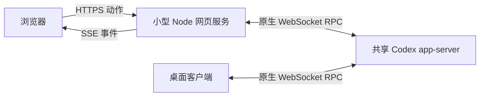

# 原生浏览器客户端：设计与交付规划

[English](../../../superpowers/specs/2026-10-07-native-web-client-design.md)
· [源码研究](../../codex-source.md)
· [后端实测](../../local-app-server-test.md)

2026-10-08 修订，等待书面设计审核；尚未开始浏览器客户端实现。本版用已经
验证的共享 app-server 路线替换原 IPC 优先方案。设计审核通过后编写实现计划，
再审核计划并选择执行方式。

## 目标与范围

浏览器打开 `https://主机IP:端口`，管理 Codex 项目、会话与工作。首版面向
单用户、单主机，增加一个与后端相同 OS 用户运行的小型网页服务。桌面与网页
连接同一个配置好的原生 app-server，由它持有账号、项目、聊天及模型执行。

开发和验收使用独立源码后端与额外桌面。原桌面保留原后端；将其改接共享实例
是运行中工作结束后的单独操作，不包含活动任务热迁移或直接修改私有 SQLite。

首个完整版本包含下表全部能力；分阶段规定交付顺序，并不省略后面的功能。
沿用既有需求的默认语义：

- “7天使用量”指账号周额度比例与重置时间，不是近期 token 活动或费用。
- “编辑工作目录”指项目名称、目录绑定；不搬动文件，旧会话保留实际 `cwd`。

## 功能契约

| 能力 | 首版行为 |
| --- | --- |
| 项目与目录 | 列出原生项目；登记已有主机目录或创建目录；编辑名称/路径；网页归档与恢复。目录选择器浏览主机，不把手机目录当工作目录。 |
| 项目归档 | 保留文件、会话与运行任务。固定版本原生 schema 没有项目归档字段，在已有私有网页偏好文件中保存归档的原生项目 ID。桌面可能仍显示该项目，不声称原生桌面归档同步。 |
| 会话管理 | 按项目列出、新建、打开、删除，显示真实原生状态，复制真实线程 ID。删除运行中会话须先完成中断并确认；保留项目文件和完成的上传。 |
| 聊天历史 | 分页、保持滚动位置，显示用户/助手消息、工具与文件，接收原生实时变化。 |
| 发送与停止 | 发到选定原生线程，运行中输入使用原生 steer/queue 行为；停止调用原生中断。失败保留草稿。 |
| 文件与照片 | 原生多选文件/照片选择器，预览、移除、串行上传进度。默认单文件 32 MiB，可配置，遵循更低的原生/模型限制；上传完成后发送附件。 |
| 下载文件 | 聊天真实文件引用转为认证下载，保留文件名和字节。按线程实际目录解析，项目改绑定后仍有效。 |
| 模型与思考强度 | 原生模型与支持强度，调整对下一轮生效并保留草稿；显示实际模型、设置及原生拒绝。 |
| 默认最大授权 | 新会话及后续发送默认全部文件/网络权限、无需执行审批，服从原生托管限制；读取不改变活动轮次权限。 |
| 上下文 | 最新活动上下文 token、可用的模型窗口与原生使用/剩余比例，压缩/换模型后更新；缺失不显示为 0。 |
| 7天使用量 | 账号周额度已用/剩余比例和重置时间，按额度桶展示。 |
| `@` | 选择文件、目录、会话和可用应用/插件，保留各自原生上下文/引用表达；引用不授权向另一会话发消息。 |
| `$` | 按工作目录列出技能，发送选中技能的原生名称/路径及可见调用。 |
| `/` | 实现 `/new`、`/model`、`/permissions`、`/status`、`/usage`、`/skills`、`/compact`、`/rename`、`/archive`、`/delete`、`/fork`、`/export` 对应的原生/界面动作；不展示终端专有命令，不虚构 `commands/list`。 |

## 选定架构

一个 Node.js 24 小服务提供固定网页资源与用户登录。浏览器原生 `fetch` 发送
动作，`EventSource`（SSE）接收流式事件；Node 原生 WebSocket 客户端向
app-server 转发原生 JSON-RPC。无需 WebSocket 服务端依赖，保留原后端的
浏览器 Origin 拒绝逻辑。唯一运行依赖是安全渲染 Markdown 的 `markdown-it`。

另一条路线是在 Rust app-server 内承载网页入口，可减少进程数量，但需要维护
源码补丁并重新编译；首版提议采用独立的小型网页服务。

- 单用户保持一个后端连接，HTTP 调用分配唯一原生请求 ID。原生通知/服务端
  请求仅发给已认证用户的事件流，页面按真实线程 ID 筛选。
- 按线程跟踪页面订阅。关闭页面不关闭后端连接、不停止任务；活动线程保留
  订阅到结束，再以 `thread/unsubscribe` 释放空闲且无人查看的线程。
- 重连执行 `initialize`/`initialized`，恢复订阅并重取权威快照后接增量。
  SSE 接收端过慢时断开并要求重同步，不无限积压内存。
- 项目登记使用原生 `project/list`、`project/create`、`project/update` 及会话
  项目归属；主机目录选择/创建复用 `fs/readDirectory`、`fs/getMetadata`、
  `fs/createDirectory`。保留其他 metadata。
- 仓库外仅保存网页偏好和上传元数据；不另建项目/聊天库，不需要桌面 IPC
  适配器或多提供商框架。
- 后端地址来自服务端配置，不接受浏览器传入任意 URL。首版连接同机回环
  `ws://127.0.0.1:4500`，无需远端后端选择器。

| 文件 | 职责 |
| --- | --- |
| `web/package.json`、锁文件 | Node.js 24；仅依赖 `markdown-it`，不加前端构建工具。 |
| `web/server.mjs` | HTTPS、固定资源、API 白名单、SSE、项目操作/偏好。 |
| `web/auth.mjs` | 密码验证、登录 Cookie、Origin 校验与登录限速。 |
| `web/codex.mjs` | 原生 WebSocket 握手、请求关联、订阅/重连、服务端请求应答。 |
| `web/files.mjs` | 流式上传、原生附件编码、经过验证的引用下载。 |
| `web/public/index.html`、`app.js`、`styles.css` | 项目/会话/聊天，模型/用量/状态；接近原生 Codex 的简洁平面布局。 |
| `web/public/composer.js` | 草稿、附件、`@`/`$`/`/`、原生范围和输入法。 |
| `web/test/*.test.mjs` | 内置 `node:test`，协议样本及 HTTPS/SSE/文件/输入检查。 |

桌面可并排三栏；手机按项目 → 会话 → 聊天逐级显示。使用系统字体、原生
对话框/选择器和剪贴板，保留可见焦点与控件标签。分阶段开发时仅显示已实现动作。

## 授权、文件与状态

统一 `full` 预设映射为新建线程的 `sandbox: "danger-full-access"`、
`approvalPolicy: "never"`，发送使用原生 `sandboxPolicy`。命名 `permissions`
和 sandbox 字段互斥。服从托管限制并显示实际生效值。原生待输入、审批及身份
请求仍需可见；每个请求只接受一次应答，并让其他窗口看到已解决状态。

主机入口使用 HTTPS、`HttpOnly`、`Secure`、`SameSite=Strict` Cookie，对包括
登录在内的每次写入检查配置好的 Origin。用 Node crypto 验证密码、限制登录
失败频率。仅开放界面需要的 RPC；账号令牌、全局配置写入和任意进程执行不作为
原始浏览器 RPC 开放。后端/模型工具执行继续服从原生策略。

配置、TLS 私钥及登录凭据存放在 `~/.config/codex-console-web/`，偏好和上传位于
`~/.local/state/codex-console-web/`，遵循 XDG 覆盖值；私有目录/文件仅属主可访问。
不静默启动另一套后端或复制账号数据库；部署明确提供共享后端地址。

先上传元数据，再发送原始二进制请求体，不手写 multipart。流式计算字节数，
中断/失败清理半文件，完成的附件保留。普通文件走经过验证的原生文件/上下文
表达，照片走图片输入；实现前核对源码与后端，不虚构二进制 `UserInput`。

下载使用绑定主机/线程/目标文件的不透明引用 ID，允许线程实际 `cwd` 及明确的
上传/生成文件根目录。拒绝路径逃逸、目录、任意 URL 抓取及符号链接竞态，既验证
引用也检查实际打开的文件。保留中文文件名与字节；Markdown 禁用原始 HTML 并
验证链接，上传的活动内容按附件下载，不作为网页执行。

## 输入、一致性与用量

- 应用/插件 mention、文件上下文和会话引用采用各自原生编码，`$` 包含原生
  `skill` 项。未知美元文本、邮箱、路径、代码保持原文，`/` 只在命令位置补全。
- JavaScript UTF-16 光标转换为原生 UTF-8 字节范围，覆盖中文和 emoji。
  输入法确认不发送/选菜单；Enter 发送，Shift+Enter 换行。
- `clientUserMessageId` 用于关联，不视为幂等保证。防止重复提交；断线不重放
  结果不确定的发送/新建/删除，先核对原生状态并保留草稿/待确认结果。
- 用 `last.totalTokens` 表示最新上下文，不用累计 `total.totalTokens`；百分比
  遵循原生扣除固定基线的口径。
- 周额度优先 `rateLimitsByLimitId`；`windowDurationMins == 10080` 才是周窗口，
  不默认 `secondary` 是周额度，不相加不同桶比例。null 为未知，账号变化清缓存。
- 模型目录不保证账号权限；原生拒绝时保留草稿并报实际结果，不偷偷换模型。

## 交付与验证

遵循 AGENTS.md：每个独立交付验证、commit、push，确认远端包含后再开始下一个。

| 阶段 | 交付与验收 |
| --- | --- |
| 0 | 复用现有编译产物，恢复独立共享后端/额外桌面；用临时数据核对输入、服务端请求、停止/删除与订阅。连接及真实生成已经验证。 |
| 1 | HTTPS/登录、后端/SSE、响应式项目/会话列表、历史、新会话、发送/停止、复制 ID、实际最大授权及原生待输入；网页和桌面显示同一线程与真实流式回复。 |
| 2 | 主机目录选择、新建/编辑项目、网页归档/恢复、原生删除会话；改绑定保留旧线程路径，归档保留文件/任务，删除等待中断。 |
| 3 | 文件/照片/预览/下载；中文文档和照片进入原生线程，生成文件逐字节正确下载，失败保留草稿和完成数据并清理半文件。 |
| 4 | 模型/强度、上下文、周额度；下一轮设置生效，压缩/换模型、null、多窗口处理正确。 |
| 5 | `@`/`$`/`/`、手机/输入法、重连、原生用户服务启动和中英文说明；引用/命令真实生效，关闭页面不停止任务，进程在工具会话结束后继续运行。 |

本次修订时，上次临时测试进程已退出，编译产物与测试数据保留。主机原生用户
服务管理器可用，交付时由其管理后端和网页服务的长期运行。预览须标明配置的
后端，不能冒充原桌面的活动任务。

必要检查覆盖：双端同线程更新；双击和写入回包丢失；运行中关闭/切换页面；
后端重启、SSE 过慢、登录过期；活动会话删除；项目改绑定/归档；中文/输入法及
代码/邮箱原文；上传限额/中断/磁盘满；下载伪造/逃逸/竞态；模型/强度/额度/
窗口缺失或变化；原生限制与待输入；未登录/跨来源访问、Markdown XSS。

代码存在后执行 `node --test web/test/*.test.mjs`，再对真实独立桌面/后端及手机
浏览器验收。纯设计改动检查需求覆盖、一致性、链接与差异，本次不声称客户端运行。

## 依据与审核交接

固定官方源码 `ff9ab4aed96aa2e105f78b9521dbbd3a6b329dc8`，GitNexus 仓库 `codex`
索引与其一致；已实测桌面 `26.928.21956`。

- [运行证据](../../local-app-server-test.md)：桌面选择 WebSocket、原生读取、
  同线程实时变化与一轮真实回复。
- [原生 RPC](https://github.com/openai/codex/blob/ff9ab4aed96aa2e105f78b9521dbbd3a6b329dc8/codex-rs/app-server-protocol/src/protocol/common.rs)、
  [项目 schema](https://github.com/openai/codex/blob/ff9ab4aed96aa2e105f78b9521dbbd3a6b329dc8/codex-rs/app-server-protocol/src/protocol/v2/project.rs)、
  [轮次输入与设置](https://github.com/openai/codex/blob/ff9ab4aed96aa2e105f78b9521dbbd3a6b329dc8/codex-rs/app-server-protocol/src/protocol/v2/turn.rs)。
- [Node.js 24 原生 WebSocket](https://nodejs.org/download/release/v24.12.0/docs/api/globals.html#class-websocket)
  与[浏览器 EventSource 标准](https://html.spec.whatwg.org/multipage/server-sent-events.html)。

书面设计批准后编写实现计划；产品代码和安装依赖前，审核该计划并选择执行方式。
原生能力核对仍是实现任务的一部分，凭据、实际用量和真实聊天数据不进入 Git。
